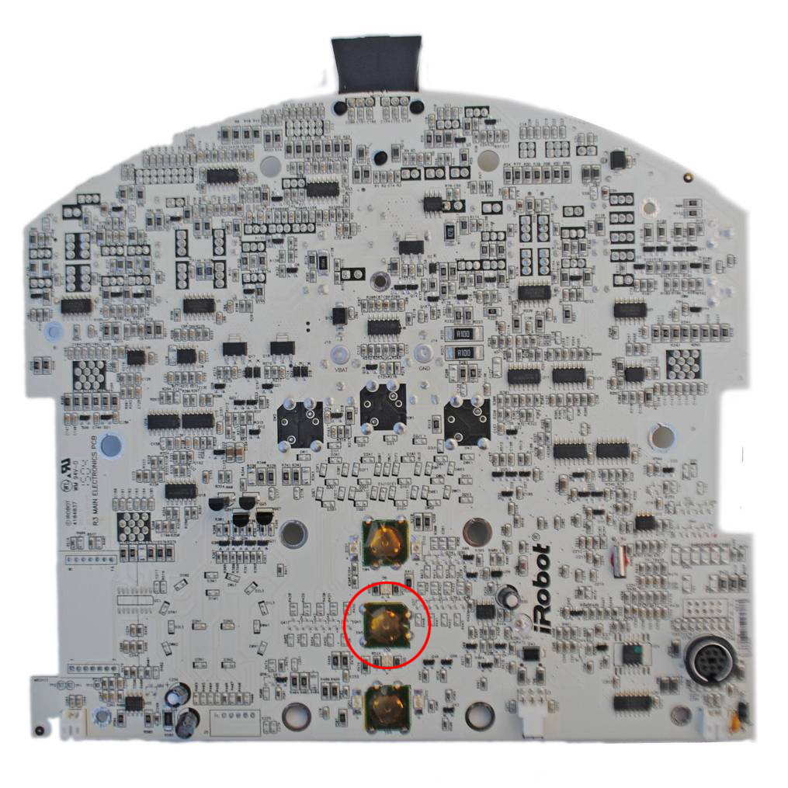

# Cloud Connected Roomba 5xx

Connect a Roomba® 581 to the Cloud with a Particle Photon

## Hardware

### Roomba®

Obviously, a Roomba® is required. I used a Roomba® 581, which is part of the [Roomba® 500 Series](http://www.irobot.com/For-the-Home/Support/Product-Resources/Roomba-500-Resources.aspx) but it should work with any Roomba with a SCI Mini-DIN 7 port that supports the Open Interface (OI).

The new [Roomba® 900 Series](http://www.irobot.com/For-the-Home/Support/Product-Resources/Roomba-900-Resources.aspx) does no longer have an SCI Mini-DIN 7 port.

### Microcontrollers

This should work with any of the below mentioned Wi-Fi connected microcontollers although it has onlry been tested with the [Particle Photon](https://www.particle.io/products/hardware/photon-wifi-dev-kit) and with its -- now discontinued -- predecessor, the [Spark Core](https://docs.particle.io/datasheets/core-datasheet/).

#### [Particle Photon](https://www.particle.io/products/hardware/photon-wifi-dev-kit)

The [Particle Photon](https://www.particle.io/products/hardware/photon-wifi-dev-kit) as well as any variations like the P0 or P1) or its -- now discontinued -- predecessor, [Spark Core](https://docs.particle.io/datasheets/core-datasheet/) or other [Particle Cloud](https://www.particle.io/products/platform/particle-cloud)-connected devices like the [RedBear Duo](https://redbear.cc/duo/) are the recommended microcontrollers. The code here is written for them. Of course it also works with the [Particle Electron](https://www.particle.io/products/hardware/electron-cellular-dev-kit) in the unlikely case that you want 2G/3G connectivity for your Roomba.

Make sure that your microcontroller has the latest firmware. [Here is a guide](https://docs.particle.io/support/troubleshooting/firmware-upgrades/photon/) on how to update the firmware for the Particle Photon.

#### [Adafruit Feather M0 WiFi](https://www.adafruit.com/product/3010) or [Adafruit Feather HUZZAH](https://www.adafruit.com/product/2821)

Since the Feather M0 and the HUZZAH are Arduino compatible, the code should also work with only minor adaptions.

#### Raw ESP8266 Board

Same goes for a raw ESP8266 WiFi microcontroller board, although personally my experience with these is very limited. I always appreciate feedback or pull-requests!

## Mini-DIN 7 Pinout

1	Vpwr	Roomba battery positive (unregulated -- 15.5 - 18V)
2	Vpwr
3	RXD		0 - 5V Serial Input to Roomba
4	TXT		0 - 5V Serial Output from Roomba
5	DD		Device Detect Input (active low), can be used to wake Roomba from sleep
6	GND		Roomba battery ground
7	GND		

## Caveats and Issues

### My Roomba® does not wake up

For Roomba® models that have no wake up input on pin 5 of the external connector, you can connect the Particle Photon to the clean button input and control this from the microcontroller. The code needs to be changed for this to work.
q
Connect the Particle Photon's `D0` pin to the Roomba®'s *Clean* button through an 8K Ω resistor.

## Support on Beerpay

If this is useful to you in any way, you can buy me a :beer:!

  